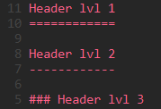
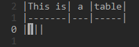
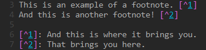
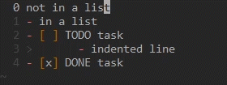

vim-markdown-utils
==================

A small collection of functions for markdown syntax.

Feel free to fork this plugin and make your own modifications, but I would appreciate feedback and suggestions as well!


MarkdownHeading(level)
----------------------

Make the current line a heading.
Supported levels 1~3.

Example:



Keybinds:
```
<leader>u1
<leader>u2
<leader>u3
```


MarkdownTable()
---------------

Create the second-line for a table using the current line as header.
It creates the third (empty) line as well, just with the columns separators, ready to punch-in your data.

Example:



Keybind:
```
<leader>tbl
```


MarkdownEmphasis(enum)
--------------------

Set the current word to *italic*, **bold**, ***strong*** or ~~strikethrough~~.

Keybinds:
```
<leader>iw
<leader>bw
<leader>sw
<leader>stw
```


MarkdownFootnote()
------------------

Add a footnote to the current line, then start editing at the end of the file.
It also saves a mark ("n" is default), to jump back to the source line.
> You can also press `<c-o>`, but (as per vim's default functionality), you will just jump back to the line, not the exact point.

Example:



Keybind:
```
<leader>fn
```

Change mark letter:
```
let g:markdownfootnote_mark = "x"
```

to whatever you prefer, by adding this to your .vimrc.


### Now featuring automatic footnotes import!
Whenever you open a markdown file, the function MarkdownFootnoteImport() will be called, and it will attempt to find existing footnotes in the file. If found, the buffer-bound variable will be updated accordingly.

In case the command doesn't trigger, or you need to re-import the footnotes, you can type the command
```
:call MarkdownFootnotesImport()
```


LineSwappie(direction)
----------------------

Quickly move the current line above or below or indent (demote) and de-indent (promote).
> Can be used in any language, as it binds to `dd` and `p` for vertical swap, and the `<<` and `>>` actions for indentation.

Keybinds:
```
<c-h>
<c-j>
<c-k>
<c-l>
```


MarkdownTask(done)
-------------------

Manage the current line (in a list) as a task.
- If the line isn't in a list, a "- " gets added before it.
	> Note: this can create conflict if there's another "-" in the line.
- If the list element is not a task, it becomes one automagically, whether you set it as TODO ``tt`` or DONE ``td``.
- Your cursor always stays where you put it.

Example:



Keybinds:
```
<leader>tt
<leader>td
```


DeleteMarkdownTask()
--------------------

Delete the task brackets in the current line.

Keybind:
```
<leader>dt
```
